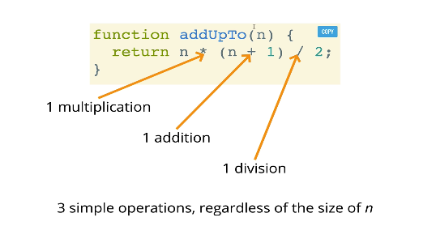
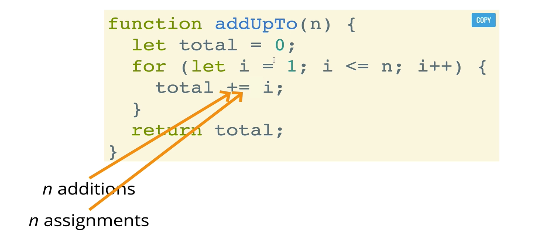
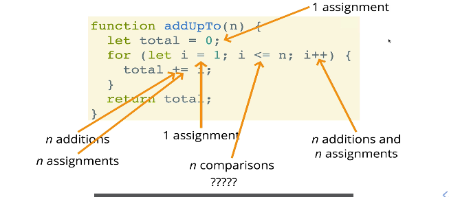
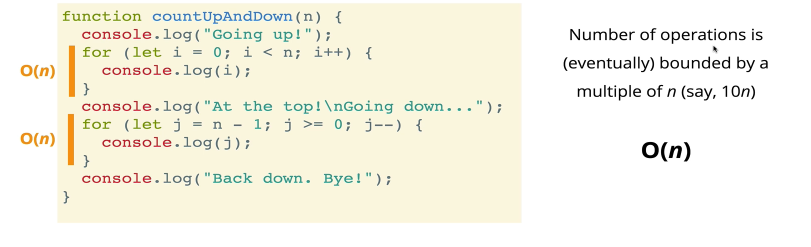
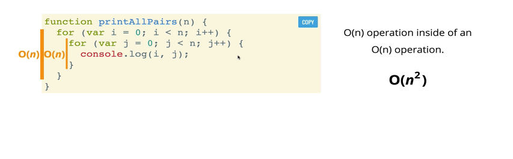
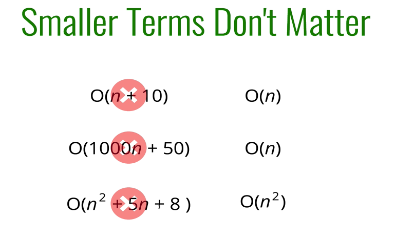
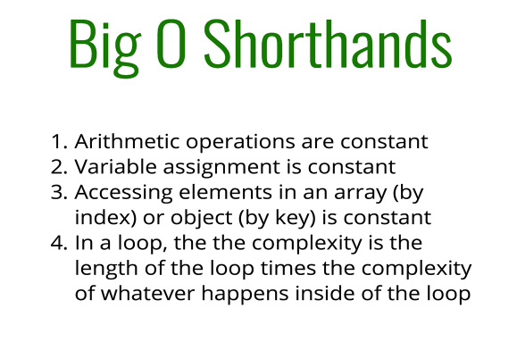
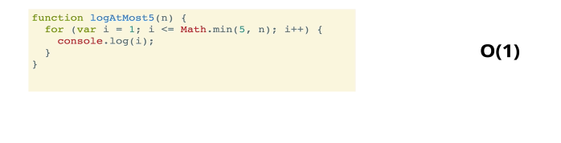
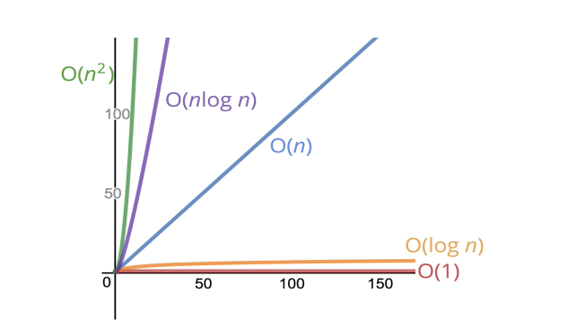

```javascript
function addUpTo(n){
	let total = 0;
	for (let i = 1;  i <= n; i++) {
		total += i;
	}
	return total;
}

// console.log(addUpTo(6))

let t1 = performance.now();
addUpTo(1000000000);
let t2 = performance.now();
console.log(`Time Elapsed: ${(t2-t1) / 1000} secondes`)
```


```javascript
function addUpTo(n){
    return n * (n + 1) / 2;    
}

// console.log(addUpTo(6));
let t1 = performance.now();
addUpTo(1000000000);
let t2 = performance.now();
console.log(`Time Elapsed: ${(t2-t1) / 1000} secondes`)
```

What does better mean?
- Faster? (1)
- Less memory-intensive? (2)
- More readable?  (3)


# 시간으로 측정하면 생기는 문제점
- 다른 기기는 다른 시간을 측정한다 (기기마다 다름)
- 같은 기기도 시간이 다를 수 있따.
- 정말 빠름 알고리즘에서는 시간 측정으로 작은 차이를 측정할 수 없음

# 시간으로 측정하지 않는다면?
- 연산의 갯수를 측정한다.


(세 번의 연산이 이뤄진다.)





(5n + 2의 연산이 이뤄진다.) -> 그래프의 선이 n값과 비례한다.

# BIG O 표기법
1) O(1)
2) O(n)





# Big O 규칙
- constants don't matter
O(2n) -> O(n)
O(500) -> O(1) 
O(13N^2) -> O(n^2)

-smaller terms don’t matter







