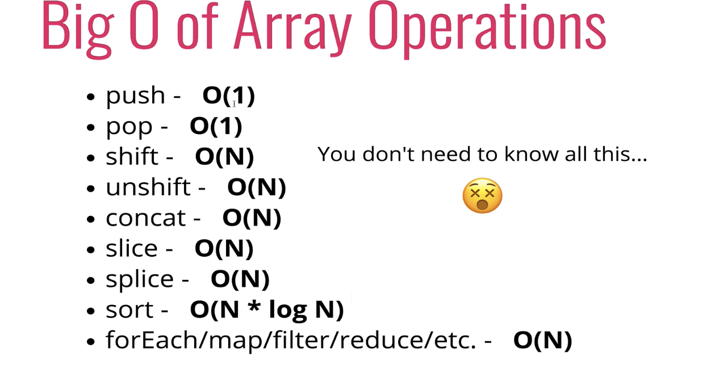

When to use arrays?
- when you need order.
- when you need fast access / insertion

- 배열의 뒤에 추가하는 것은 큰 문제가 없다.
- 하지만 배열을 제일 앞에 추가를 한다면 모든 Item의 index가 바뀌므로 O(N)의 시간복잡도가 걸린다.

* 삭제도 마찬가지이므로 배열의 앞에 추가, 삭제하는 것은 비효율적일 수 있다.

