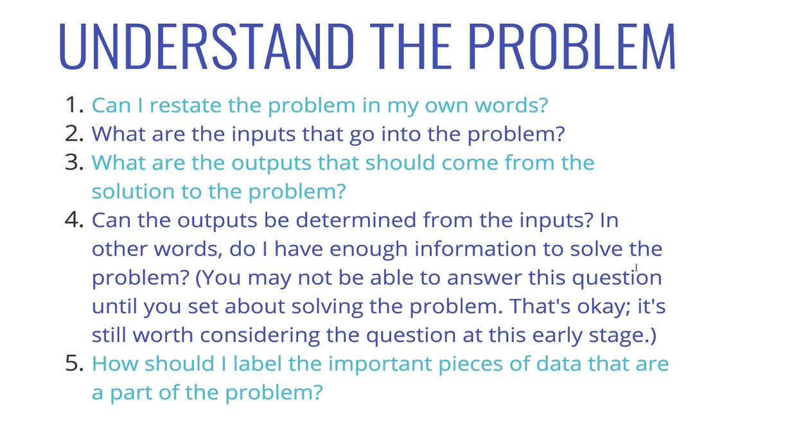

Understand the Problem.

Question. Write a function which takes two numbers and returns their sum.

**1. Can I restate the problem in my own words?
**- ints?
- floats?

**2. What are the inputs that go into the problem?
3. What are the outputs that should come from the solution to problem?
4. Can the outputs be determined from the inputs?
5. How should I label the importants pieces of data that are a part of the problem?**

