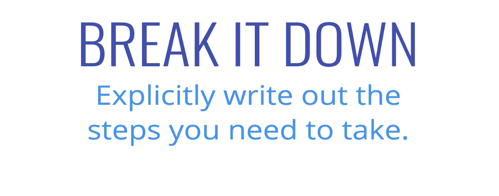

Break It Down



- Explicitly write out the steps you need to take.


```
function charCount(str) {
// make object to return at end

// loop over string, for each character...
	// if the char is number/letter AND  a key in object, add one to count
	// if the char is number/letter AND not in object, add it and count 1
	// if character is something else (space, period, etc.) don’t do anything.

// return object at end
}
```