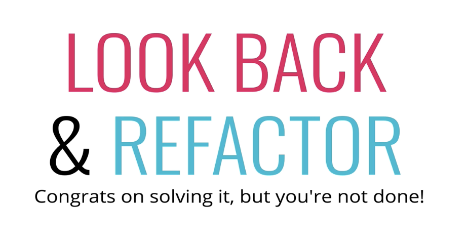
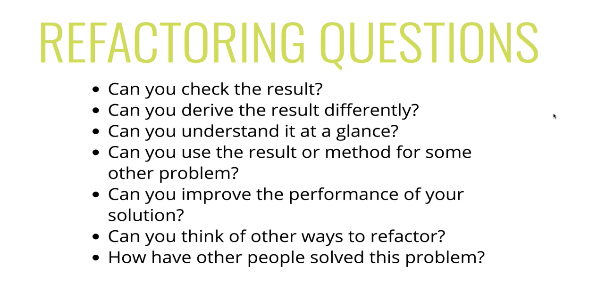
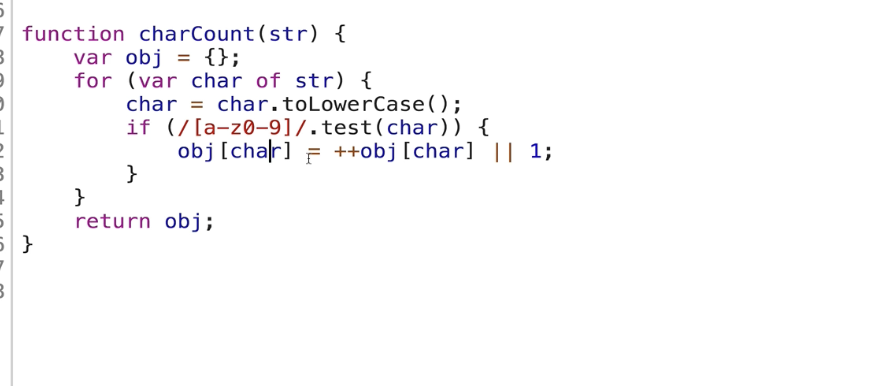
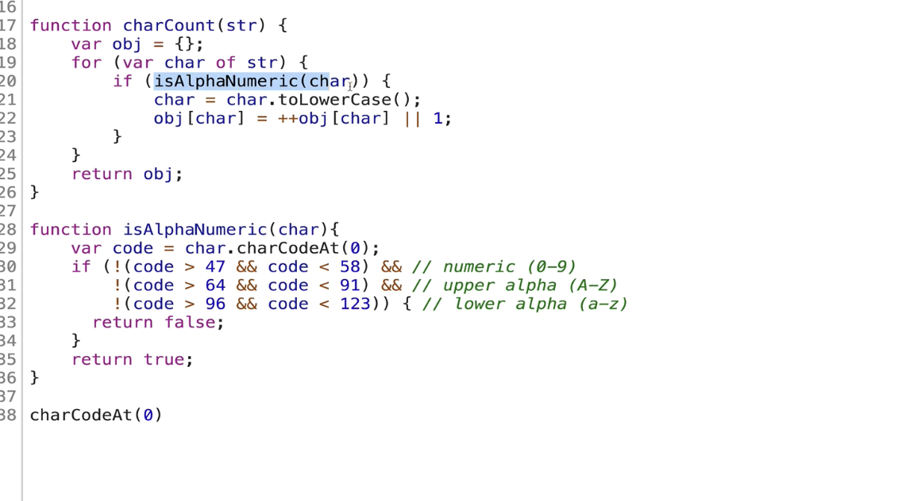

Look back & Refactor





```
function charCount(str) { 
// make object to return at end 
var result = {};
// loop over string, for each character... 
for(var i = 0; i < str.length++; i++){
	var char = str[i].toLowerCase();
	if(/[a-z0-9]/.test(char)){
		if(result[char] > 0) {
		// if the char is number/letter AND a key in object, add one to count 
		result[char]++;
	} else {
		// if the char is number/letter AND not in object, add it and count 1 
		result[char] = 1;
	}
	}

// if character is something else (space, period, etc.) don’t do anything. 

// return object at end }
return result
}

```





